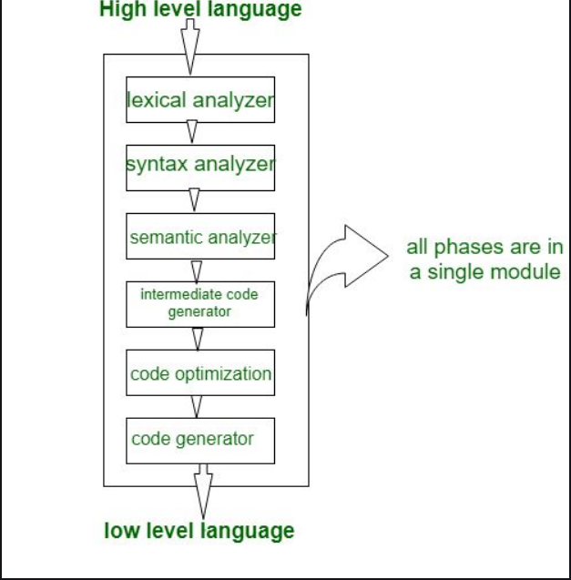
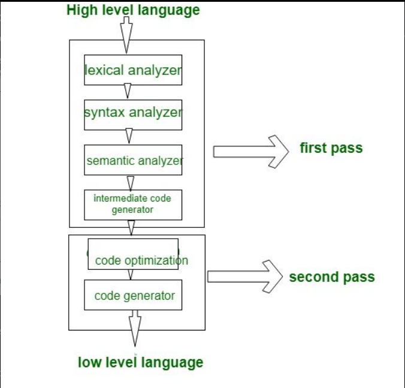

# Compilers
## Introduction
Compilers are programs that operate on some sort of text that conforms to a particular set of predefined rules (known as a computer language) and translate it into some other sort of computer language.  The most common use of this concept is to take human-readable text written in a high-level computer language and transform it into a set of low-level instructions that can be operated on by a computer.    A working compiler is often itself a multi-step process, with two of the most common steps being a lexical analyzer component (or lexer) that groups and categorizes individual textual items in the source code and a syntax analyzer component (or parser) that checks the lexer's output against the language's grammar to ensure that the input provided by the programmer correctly follows the syntax of the language so that the semantic intent of the programmer can be systematically translated into machine code.

## History of Compilers
The first known compiler was known as Plankalkul, and was created by a PhD student in Germany during World War II (

## Compiler Operation
A compiler is a program that translates a programming language's source code into machine language and it performs various operations such as parsing, preprocessing, lexical analysis, and semantic analysis. The 3 phases of a compiler are Lexical Analysis, Syntax Analysis and Semantic Analysis. Lexical Analysis is the process of converting a sequence of characters into a sequence of lexical tokens which are Strings with an assigned and identified meaning. Lexical Analysis is the first of a compiler. The second phase of a compiler is the syntax analysis. Syntax analysis is the process of analyzing a string of symbols either in natural language, computer language or data structures conforming to the rules of a formal grammar. The parser receives the source code in the form of tokens from the lexical analyzer and performs syntax analysis, which create a tree-like intermediate representation that depicts the grammatical structure of the token stream. The are two main ways to parse which is Top-down parsing and Bottom-up parsing. Top-down parsing starts from the root of tree and builds down to the leaves and the tokens are processed from left to right. Bottom-up parsing starts from the leaves and builds the tree up to the root and tokens are processed from left to right. The third phase of the compiler is Semantic Analysis which is the process of drawing meaning from text. It allows computers to understand interpret sentences, paragraphs, or whole documents by analyzing their grammatical structure, and identifying relationships between individual words in a particular context.  

## Compiler Basics

### Single, Two, and Multi Pass Compilers

Define and explain the similarities and differences between these types of compilers:

A key concept of compiler construction is a _pass_. A pass is defined as a complete traversal of the source code to be compiled. How many passes that a compiler designer may choose to use depends on the limitations of hardware and the complexity of the language. Generally, a simple language may be able to process the source code in a single pass where a more complex language would require more [1].

**Single Pass Compiler**

A single pass compiler does all compilation steps in a single pass. This is usually easier to implement as well as computationally faster since it only processes the source code once. However, further code optimizations may not be found.

 [2]

This type of compiler is almost never seen in the wild. It is more of an academic exercise. An early version of Pascal did use this design [2].

**Two Pass Compiler**

Compilation in two passes may be computationally slower, but provides opportunities for further optimization of the source code. The image below breaks the process into to parts:

1. Does the analysis and generates intermediate code
2. Does a pass of the intermediate code to further optimize before it generates the final code

 [2]

Still more optimizations can be found if the compiler is allowed more passes.

**Multi-Pass Compiler**

When a compiler design involves multiple passes the steps are further broken down. This provides specific checks and optimizations on each pass.

 [2]

Most compilers at the time of writing use this design as it allows languages to run on different operating systems and hardware. It handles complex high level languages well and provides the most optimizations for the source code. Although multiple passes does take longer the trade off here is that the checks and optimizations achieved through each pass provide more reliable and fast software in the long run.

## Compilers vs Interpreters   

The differences between a compiled and interpreted language are mainly based on the result or outcome from the process of interpreting or compiling the given source. 

With a compiled language, the source code is first compiled and it is converted into machine code that has readable instructions for the computer which allows the process to execute. Compiled languages tend to be much faster and more efficient than interpreted languages because the program is turned into native machine code. Although the entire program needs to be read and translated in order for it to be executed, any errors that are found will prevent the compilation to complete and displays what the error is and where to find it. A disadvantage to compiling languages is that it is not portable, the programs are generally platform dependent and will need to be rewritten if it runs on different platform. Additionally, when the programmer wants to update the program it is has to be entire code as to be rewritten or re-compiled.

With an interpreted language, unlike the compiler, the source code is read as it is by an interpreter. The interpreter parses through the program line by line executing each command. Unfortunately, due to the process of translating each line of code during runtime takes time and can cause the program execution time to be slower overall. Unlike compilers, interpreted languages are much more flexible, with features such as dynamic typing and smaller program sizes. Additionally, they are more portable, since the source code is not changed but executed as is, the code is platform-independent.

## Bibliography

[1] "Compiler," Wikipedia, May 03, 2020. https://en.wikipedia.org/wiki/Compiler.
Visited May, 4, 2023.

[2] "Single pass, Two pass, and Multi pass Compilers," GeeksforGeeks, Mar. 13, 2019. https://www.geeksforgeeks.org/single-pass-two-pass-and-multi-pass-compilers/. Visited May, 4, 2023.
